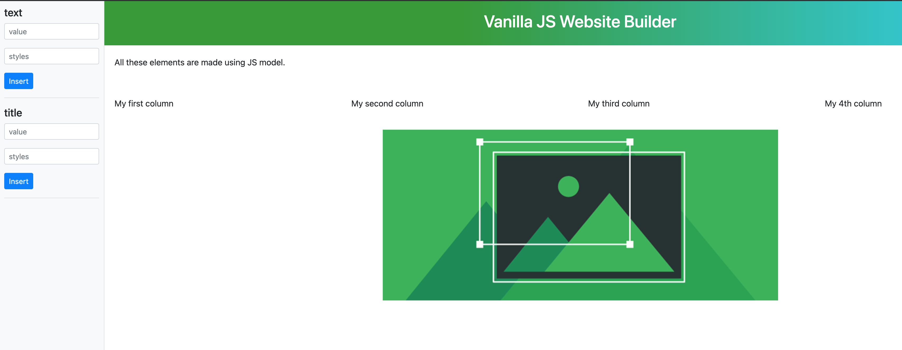

# Vanilla JS Page Builder

An application that allows you to dynamically add elements to a web page using pure JavaScript

### Requirements

- Mac / Linux / Windows
- Browser Chrome / Safari / FireFox / Edge

### Install

```bash
$ git clone git@github.com:kalapyha/page-builder
$ cd page-builder
$ npm run-script serve        
```
- Open http://localhost:4200 
- Load unpacked add directory chrome_extension/dist

### Try this app online

Link to the live version of the app <https://my-js-sitebuilder.web.app/> 

